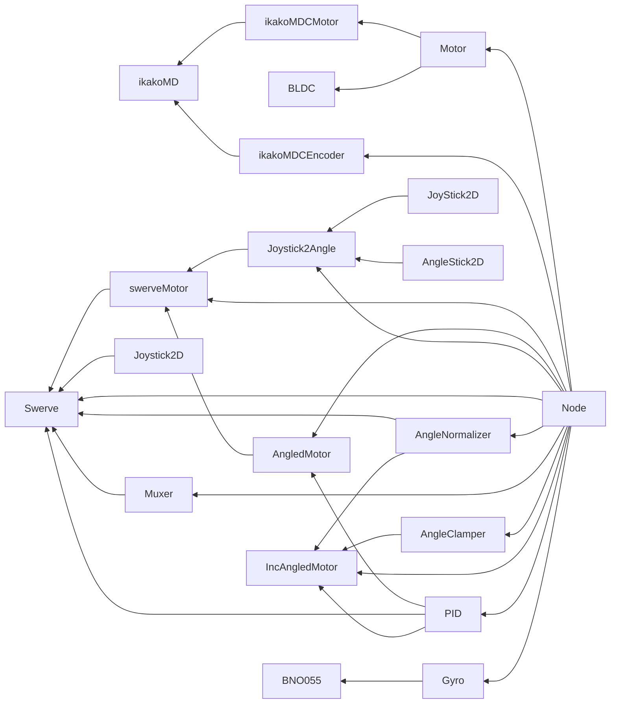

# めもとか

## Robo++ の依存関係グラフ

## タスク一覧

- [ ] (はやくやる) ESP32 の Websocket 接続切れに対応して EMC ストップ
- [ ] (はやくやる) | 上に付随して EMC ストップのリプライパケットを定義
- [ ] (はやめにやる 1) ESP32 のサーバー指定めんどい --> UDP ブロードキャストで通知
- [ ] (はやめにやる 1) 通信がなんか遅い
- [ ] (はやめにやる 2) ESP32 に mDNS を統合
- [ ] (はやめにやる 3) ノード可視化
- [ ] (いつかやる) エンコーダーのノードを作成 --> 頑張る
- [ ] (いつかやる) Pipe を実装 <== Link#Node 使いづらい
- [ ] (いつかやる) Node の状態等をクライアント上で見れるようにする
- [ ] (いつかやる) libstm-ota の src/init/init_wifi.cpp で認証モードを考慮した設定をする
- [ ] (どうでもいい) Swerve Controller の Angle を float 単体に
- [x] (はやくやる) ikakoMDC がつながらない --> 頑張る
- [x] (はやくやる) BNO055 が基板上でつながらない
- [x] (はやめにやる) 接続が不安定 --> ESP32 をクライアントにする？
- [x] (はやめにやる 2) 接続しやすいようにする ==> location.hostname を参照した

## 教訓

- クラスのサイズが 2048 を超えるとスタックを食いつぶす可能性があるので注意
- Thread についても同様にスマートポインタで持ったほうがいい
- ポインタは大体沼
  - スマートポインタを使おう 参照型も有効だが初期化がめんどいなときはスマートポインタ
  - ロボコンでは unique_ptr が主？
- ムーブセマンティクスの削除は有意義
- フレームワークから作ると意外と大変
- MBed OS のデバッグ
  - Location に出てくるアドレスはあくまでエラーを送出したところであって、エラーの要因を生み出したユーザーコードの場所ではない
  - あと、実行まで少なくとも 10 秒はかかるのでめんどくさい --> エミュレーターを作る…？
