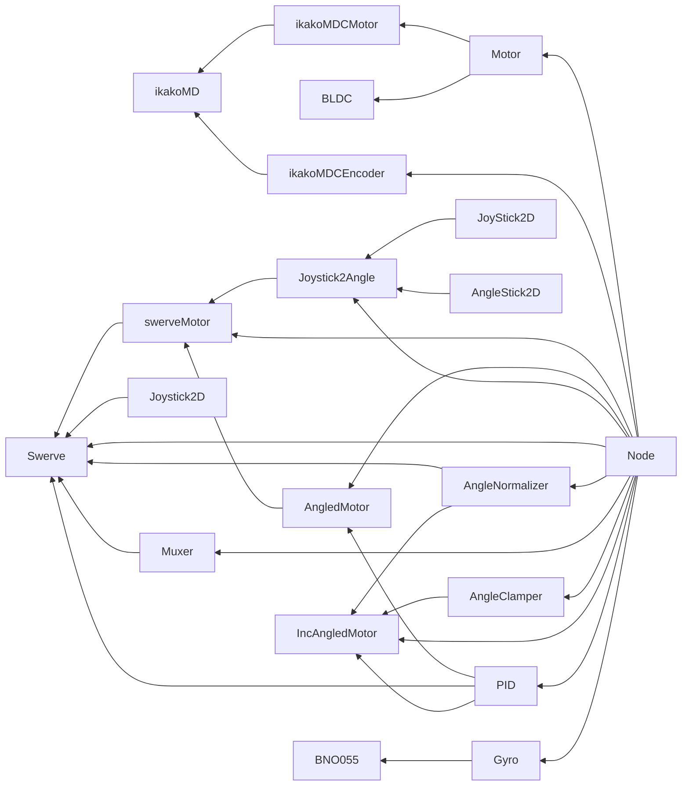

# めもとか

## Robo++ の依存関係グラフ

## タスク一覧

- [ ] (はやくやつ) BNO055 が基板上でつながらない
- [ ] (はやくやる) ikakoMDC がつながらない --> 頑張る
- [ ] (はやめにやる) 接続が不安定 --> ESP32 をクライアントにする？
- [ ] (いつかやる) エンコーダーのノードを作成 --> 頑張る
- [ ] (いつかやる) Pipe を実装 <== Link#Node 使いづらい