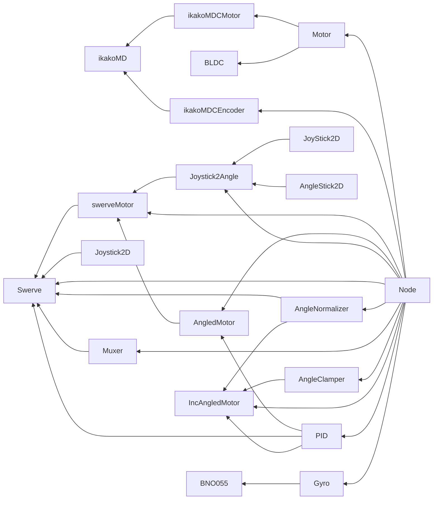

# めもとか

## クラス間依存関係グラフ

## 終わったら書く esa

- ステア
- スマホ操作
- Makefile

## タスク一覧

- [-] (はやめにやる 1) 通信がなんか遅い --> 多分解決？
- [ ] (はやめにやる 3) ノード可視化
- [ ] (いつかやる) ControllerBase<void> をかけるように Action の実装が汚い
- [ ] (いつかやる) エンコーダーのノードを作成 --> 頑張る
- [ ] (いつかやる) Pipe を実装 <== Link#Node 使いづらい
- [ ] (いつかやる) Node の状態等をクライアント上で見れるようにする
- [ ] (いつかやる) libstm-ota の src/init/init_wifi.cpp で認証モードを考慮した設定をする
- [ ] (どうでもいい) Swerve Controller の Angle を float 単体に, ここの magnitude 使ったことない
- [?] (やる) ESP32 の無線書き込み治す　めっちゃ失敗する --> 多分大丈夫
- [x] (はやくやる) ikakoMDC がつながらない --> 頑張る
- [x] (はやくやる) BNO055 が基板上でつながらない
- [x] (はやめにやる) 接続が不安定 --> ESP32 をクライアントにする？
- [x] (はやめにやる 1) ESP32 のサーバー指定めんどい --> UDP ブロードキャストで通知
- [x] (はやめにやる 2) 接続しやすいようにする ==> location.hostname を参照した

## 教訓

- クラスのサイズが 2048 を超えるとスタックを食いつぶす可能性があるので注意
- Thread についても同様にポインタライクなものでで持ったほうがいい
- ポインタは大体沼
  - スマートポインタを使おう 参照型も有効だが初期化がめんどいなときはスマートポインタ
  - ロボコンでは unique_ptr が主？
  - Thread は生ポインタでもいいかも
- ムーブセマンティクスの削除は有意義
- フレームワークから作ると意外と大変
- MBed OS のデバッグ
  - Location に出てくるアドレスはあくまでエラーを送出したところであって、エラーの要因を生み出したユーザーコードの場所ではない
  - フレームワーク作るか？？？？の勢い
  - あと、リビルドから実行まで少なくとも 10 秒はかかるのでめんどくさい --> エミュレーターを作る…？
- サイズに余裕があるなら拡張性を重視するべき
  - コントローラー要素が多くなってくるとサイズ不足になる可能性がある