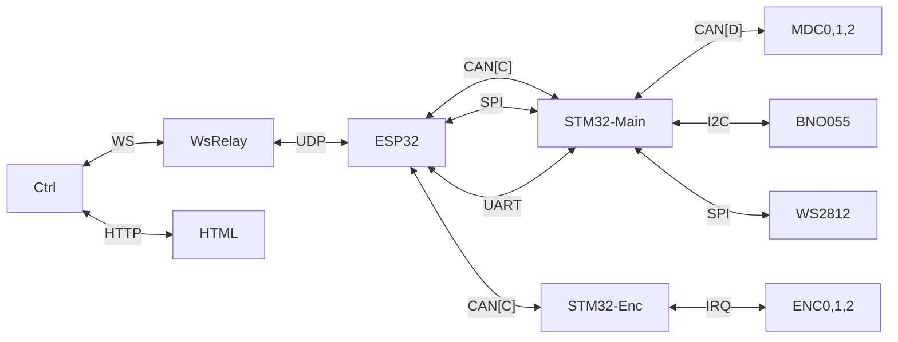

# Arch

```mermaid
graph LR
  Ctrl <-- WS --> WsRelay
  Ctrl <-- HTTP --> HTML
  WsRelay <-- UDP --> ESP32
  ESP32 <-- CAN[C] --> STM32-Main
  ESP32 <-- CAN[C] --> STM32-Enc
  STM32-Main <-- CAN[D] --> MDC0,1,2
  STM32-Main <-- I2C --> BNO055
  STM32-Main <-- SPI --> ESP32
  STM32-Main <-- UART --> ESP32
  STM32-Main <-- SPI --> WS2812
  STM32-Enc <-- IRQ --> ENC0,1,2


```